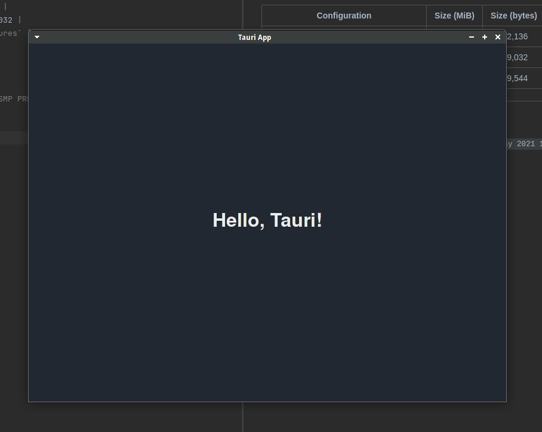

# Hello, Tauri! 

Absolute minimal hello world for [Tauri](https://github.com/tauri-apps/tauri). This exists so that I can independently
experiment with things surrounding the resulting application. For now, this covers:
* [Binary sizes](#binary-sizes)
* [WebDriver testing in GitHub Actions](#webdriver-testing-in-github-actions)

## Screenshot

_I **did** say absolutely minimal._

## Binary Sizes

The following binaries have had been built with `--release` and have had
`strip --strip-all` run on them.

| Configuration | Size (MiB) | Size (bytes) |
| ------------- | ---------- | ------------ |
| _stable_ | 3.1MiB | 3,162,136 |
| `build-std` | 2.8MiB | 2,859,032 |
| `build-std` + `build-std-features` | 2.5MiB | 2,539,544 |

`Linux dev 5.12.5-arch1-1 #1 SMP PREEMPT Wed, 19 May 2021 10:32:40 +0000 x86_64 GNU/Linux` btw

## WebDriver testing in GitHub Actions

You will need to read the code for more information about this, until `tauri-driver` become pre-alpha with docs.

Check the [GitHub Action workflow file](./.github/workflows/webdriver.yml) for the requirements on the CI and the steps
taken in order to build and then test the application. Also see the [`webdriver/`](./webdriver/) dir for the actual
[Jest](https://jestjs.io/) test code which launches the program + a webdriver client for each test. Note: the tests are
ran with `yarn jest --runInBand` because there can only be 1 application opened at a time that is automated - A
workaround may come later.

You can click the badge at the top of this readme to check the latest WebDriver test results.

